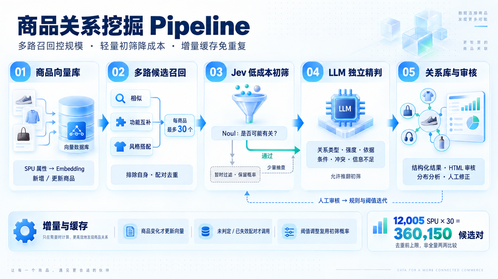

# 商品关系挖掘与审核 · SPU Relation Mining

> 从商品库到「值得进一步评估的关系」的本地两阶段流水线：**向量召回 → Jev 初筛 → LLM 精判**，并附带一个可人工标注、可阈值预览的本地审核台。

面向零售/时尚/美妆类目的 SPU（Standard Product Unit）关系挖掘。全程本地运行，**候选规模有界、各阶段可缓存、失败可恢复、结果可追溯**；不引入分布式任务系统、远程向量库或前端构建链。


---

## 目录

- [特性](#特性)
- [架构](#架构)
- [快速开始](#快速开始)
- [使用](#使用)
- [核心概念](#核心概念)
- [配置参考](#配置参考)
- [数据说明](#数据说明)
- [测试](#测试)
- [项目结构](#项目结构)
- [已知限制与路线图](#已知限制与路线图)

---

## 特性

- **多路召回**（每个商品最多 30 个无序候选）：相似 / 功能互补 / 风格搭配三通道，彼此独立、不重复查询。
- **两阶段判定**：Jev Noul 初筛（低成本概率）→ 通过者由 LLM 三维精判；初筛过滤、精判无关系、调用失败三者严格区分。
- **成本可控**：embedding 支持百炼 Batch 文件接口（约实时 50% 费用）；`--llm-cap` 单独限制精判调用数。
- **分层缓存**：商品/查询 embedding、初筛、精判各自独立缓存，按哈希与配置版本失效，重复执行零冗余调用。
- **断点可续**：中断后直接重跑即续跑，已完成的阶段与商品对不会重复调用；失败对自动重试。
- **本地审核台**：单文件 HTML，含流程统计、概率分布、阈值预览（复用已存概率、不触发模型请求）、商品对详情与人工标注。

---

## 架构

```text
数据 (data/prod_df.csv)
        │  商品标准化 / 双哈希 (product_hash, embedding_text_hash)
        ▼
   Embedding        ──▶  本地向量索引 (numpy 暴力余弦)
        │                       │
        │         ┌─────────────┼─────────────┐
        │         ▼             ▼             ▼
        │      相似召回      功能互补        风格搭配
        │         └─────────────┼─────────────┘
        │                       ▼
        │              无序配对去重 + 来源合并（≤30/商品）
        │                       │
        │                       ▼
        │              Jev Noul 初筛（概率阈值 + 低分抽查）
        │                       │ 通过 / 抽查
        │                       ▼
        │               LLM 三维精判（替代 / 功能互补 / 穿搭搭配）
        │                       │
        └─────────────▶  SQLite 持久化  ◀──── 审核台（统计 / 阈值预览 / 人工标注）
```



---

## 快速开始

### 前置要求

- Python **3.11+**
- [uv](https://docs.astral.sh/uv/)（推荐；也可直接用 `pip` + `python`）
- 数据文件 `data/prod_df.csv`（不随仓库分发，见[数据说明](#数据说明)）

### 安装

```bash
git clone https://github.com/Wanke15/llm_product_relation_mining.git
cd llm_product_relation_mining
uv sync
```

依赖极简：运行时仅 `numpy`（本地向量索引）。原计划用的 `hnswlib` 在 Python 3.11 / Windows 无预编译 wheel，已回退为 numpy 暴力余弦（12k 规模毫秒级），`VectorIndex` 协议保留，后续有 wheel 可插回。

### 配置

```bash
cp .env.example .env   # 编辑 .env，填入 API key
```

密钥只保留在本地 `.env`，**不入库、不进日志与运行快照**。未配置时自动回退离线 demo 后端（哈希 embedding / 规则初筛 / 规则精判），仅用于打通流程，不代表模型效果。

### 一键运行

```bash
uv run python -m relations index
uv run python -m relations retrieve
uv run python -m relations pipeline --dry-run
uv run python -m relations serve          # 打开 http://127.0.0.1:8765
```

---

## 使用

```text
index      同步商品、生成缺失向量、重建索引（embedding 走缓存，不重复调用）
retrieve   三通道召回，落库候选（不调用 Jev/LLM）
pipeline   两阶段流水线：初筛 → 路由 → 精判
serve      本地审核台（统计 / 阈值预览 / 商品对详情 / 人工标注）
```

```bash
# ① 索引（首次全量会走 embedding，后续增量命中缓存）
uv run python -m relations index

# ② 召回：每商品最多 30 个无序候选
uv run python -m relations retrieve --top-k 30
uv run python -m relations retrieve --top-k 30 --limit 500   # 限本次候选商品对数量

# ③ 两阶段流水线
uv run python -m relations pipeline --limit 5000 --llm-cap 0  # 只初筛不精判
uv run python -m relations pipeline --llm-cap 2000            # 全量初筛 + 精判上限 2000
uv run python -m relations pipeline --resume RUN_ID           # 恢复（已缓存对自动跳过）

# ④ 审核台
uv run python -m relations serve --port 8765
```

> `--limit` 限的是**候选商品对数量**（初筛、精判都被圈在这个范围内）；`--llm-cap` 只额外限制**精判调用数**。二者语义不同，别混用。
>
> 中断后**直接重跑同一条命令即可续跑**，无需 `--resume`（它只是把续跑记到同一个 run 下），因为缓存键是逐对的、不含 run id。

---

## 核心概念

### 三通道召回

| 通道 | 查询描述 | 说明 |
| --- | --- | --- |
| `similar` | 商品自身文档 | 原商品语义向量近邻检索 |
| `functional` | `{目标类目组}，风格{风格}，季节{季节}` | 按类目角色构造的「使用互补」目标描述 |
| `style` | `{目标类目组}，风格{风格}，季节{季节}` | 按穿搭角色 + 风格/季节构造的「穿搭搭配」目标描述 |

三个通道通过完全不同的查询文本检索，**不是同一个商品向量重复查询**。功能互补/风格搭配的目标来自 `relations/config/complement_roles.json`（按 `部门|类目组` 配置角色与目标）；未映射的类目该通道自动停用并在输出中报告覆盖情况。

性别过滤（`relations/config/gender_rules.json`，`部门|类目组` → 女/男/中性）：召回后丢弃「女↔男」硬冲突的候选，中性候选 / 同性别保留，三通道统一生效。

### Jev Noul 初筛

每对候选先问一个 [Noul](https://docs.typesafe.ai/primitives/noul)（TypeSafe 初筛）：

> 两件商品是否存在至少一种值得进一步评估的关系：替代 / 功能互补 / 穿搭互补？

- 输出是「关系成立的**概率**」，不是关系强度；
- 达到 `.env` 的 `SCREEN_THRESHOLD` → 进精判；低于阈值 → 记为 `screened_out`（**≠ 确认无关系**）；
- 低分对按 `SCREEN_AUDIT_RATE` 固定种子抽查一小部分进精判，路径可复现；
- 超时 / 服务失败 / 格式错误**单独记为 `error`**，不当作低概率；
- 关键信息不足记为 `insufficient_input`，不伪造概率。

进入精判的原因会被显式记录：`normal`（正常通过）/ `audit`（抽查）/ `forced`（显式强制）。

### LLM 精判

沿用 `prompts/rubric.json` 规则，三个维度独立评分：

- `similarity`（相似替代）
- `functional_complement`（功能互补）
- `style_pairing`（穿搭搭配）

每维：`score`（0 不成立 / 1 弱 / 2 明确但有条件 / 3 强 / `null` 未知）、`reason`、`evidence`、`conditions`、`conflicts`、`missing_information`。

LLM **独立判断**，可否定初筛结论；初筛结论与召回分数**不会**写进精判 prompt；证据必须等于输入字段的原值，否则该对判为失败。

### 分层缓存与失效

| 缓存 | 有效性依据 |
| --- | --- |
| 商品 embedding | 输入文本哈希 + embedding 模型/版本 |
| 查询 embedding | 检索描述哈希 + 模板版本 + 模型/版本 |
| Jev 初筛 | 无序商品对 + 双方 `product_hash` + 初筛规则 + 后端配置版本 |
| LLM 精判 | 无序商品对 + 双方 `product_hash` + 精判规则 + 后端配置版本 |

- 密钥不进入任何缓存键、日志或快照；
- 模型别名变化可用 `EMBEDDING_REVISION` 手动失效；
- 调整初筛阈值**复用已存概率**重算路由，不重跑 Jev；
- 商品字段变化 → `product_hash` 变 → 涉及它的判定失效重跑。

---

## 配置参考

完整见 `.env.example`。关键项：

| 变量 | 说明 | 默认 |
| --- | --- | --- |
| `EMBEDDING_URL` / `EMBEDDING_API_KEY` / `EMBEDDING_MODEL` | OpenAI 兼容 embedding 端点 | 空（回退离线哈希） |
| `EMBEDDING_BATCH_MIN` | 达到该文本量改走 Batch 文件接口（约 50% 费用） | `64` |
| `CANDIDATES_PER_PRODUCT` | 每商品候选上限 | `30` |
| `SIMILARITY_TOP_K` / `FUNCTIONAL_TOP_K` / `STYLE_TOP_K` | 三通道配额 | `10/10/10` |
| `SCREEN_PROVIDER` / `JEV_URL` / `JEV_API_KEY` / `JEV_MODEL` | Jev Noul 初筛 | `jev` |
| `SCREEN_THRESHOLD` | 初筛概率阈值（未校准，需标定） | `0.5` |
| `SCREEN_AUDIT_RATE` | 低分抽查比例 | `0.02` |
| `DETAIL_PROVIDER` / `LLM_URL` / `LLM_API_KEY` / `LLM_MODEL` | LLM 精判 | `llm` |
| `SCREEN_CONCURRENCY` / `DETAIL_CONCURRENCY` | 阶段并发（默认小并发） | `4` |
| `DB_PATH` / `INDEX_DIR` | SQLite 与索引路径 | `data/relations.db` / `data/index` |

---

## 数据说明

输入 `data/prod_df.csv`（约 12k SPU，字段含商品名、部门、类目组、类目、细分类目、特征、风格、主题、属性、可选颜色、季节、价格等）。

- **该文件属业务敏感数据，不随仓库分发**，请自备后放到 `data/` 下；
- 金额保留在商品数据中、默认不进入 embedding 文本；图片 URL 仅用于人工审核，不进当前文字 embedding；
- `available_colors` 是 SPU 可选颜色集合，不是单件配色。

---

## 测试

```bash
uv run python -m unittest discover -s tests
```

共 39 个用例，覆盖：候选有界与去重、多通道来源合并、三通道查询互异、商品/向量/初筛/精判缓存命中与失效、阈值调整不重跑、低分抽查可复现、二阶段失败恢复不重复一阶段、`--llm-cap 0` 语义等。

---

## 项目结构

```text
relations/
  core.py          商品标准化、证据校验、关系标签
  document.py      商品文档模板 + 双哈希
  embedding.py     OpenAI-compatible + 本地哈希 embedding（含 batch 路由）
  vector_index.py  向量索引协议 + numpy 实现
  recall.py        三通道召回 + 去重 + 性别过滤
  screen.py        Jev Noul 初筛 + 离线 demo
  pipeline.py      两阶段流水线（缓存 / 恢复 / 并发 / 限流）
  providers.py     Judge 协议 + LLM/Jev/demo 后端
  batch.py         百炼 Batch 文件接口客户端
  store.py         SQLite 存储层
  config/          角色映射 + 性别规则（可编辑配置）
prompts/rubric.json
web/index.html     审核台（单文件，无构建）
tests/             unittest 测试
```

---

## 已知限制与路线图

- 向量索引当前为 numpy 暴力余弦；`hnswlib` 待其提供 Python 3.11 Windows wheel 后可插回。
- 角色映射 / 性别规则是**候选生成**层面的启发式，覆盖不到或不明确的类目通道自动停用；召回质量未做深度优化。
- 初筛阈值 `0.5` 为未校准试验值，需按线上数据用阈值预览标定。
- `forced` 精判路由（显式强制某对进精判）已预留字段，尚无 CLI 入口。
- 未实现多模态判定、统计显著性检验与线上推荐。

---

## License

待定（`LICENSE` 文件尚未添加）。